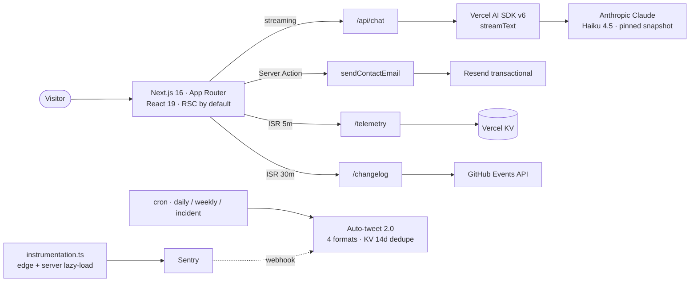
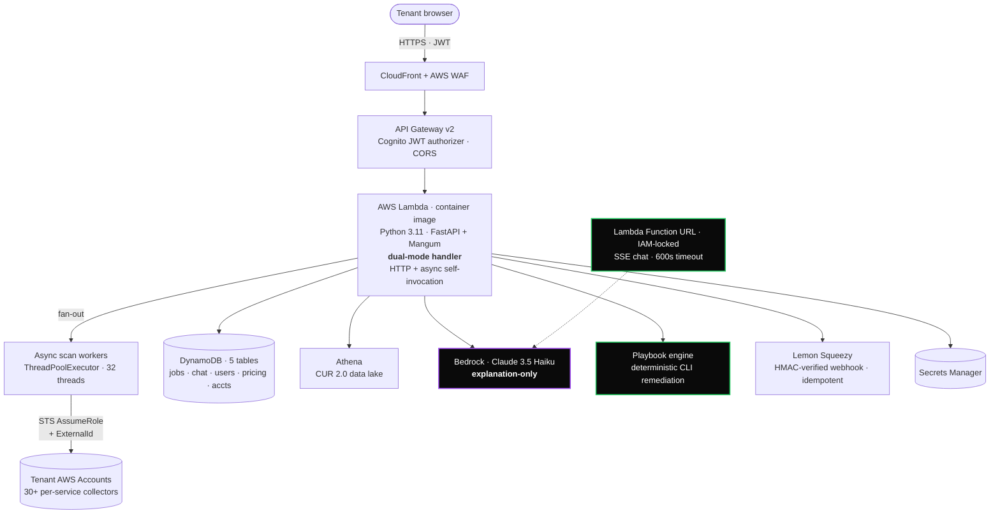
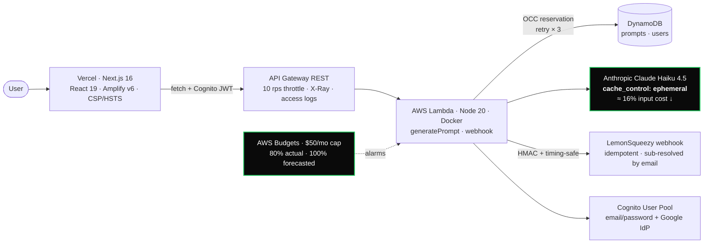
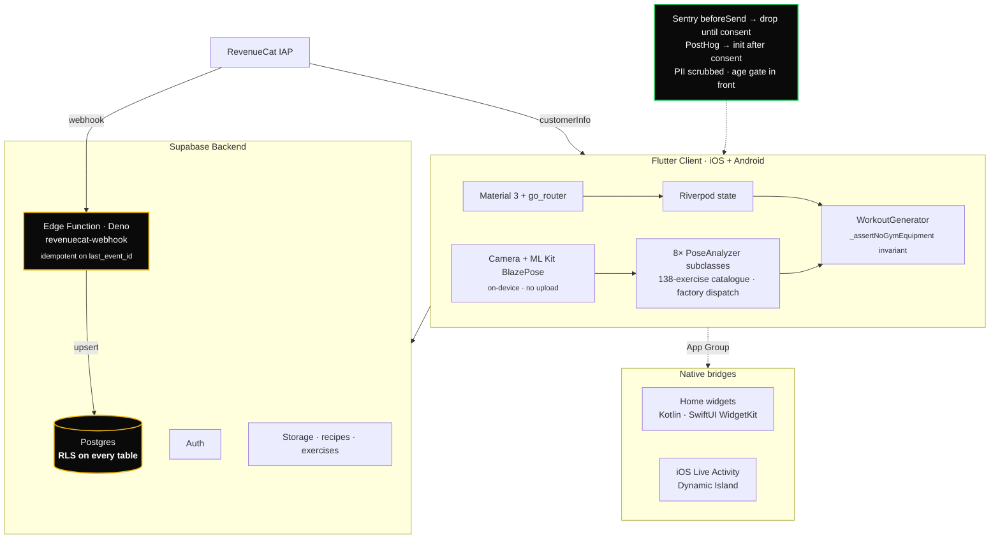
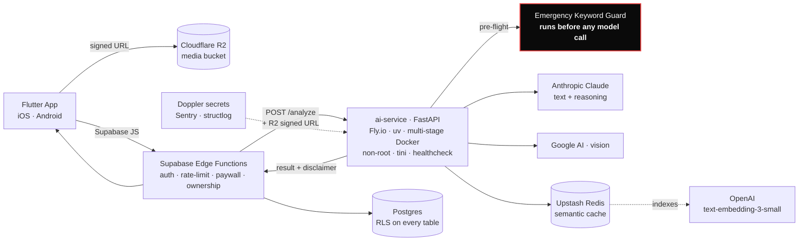
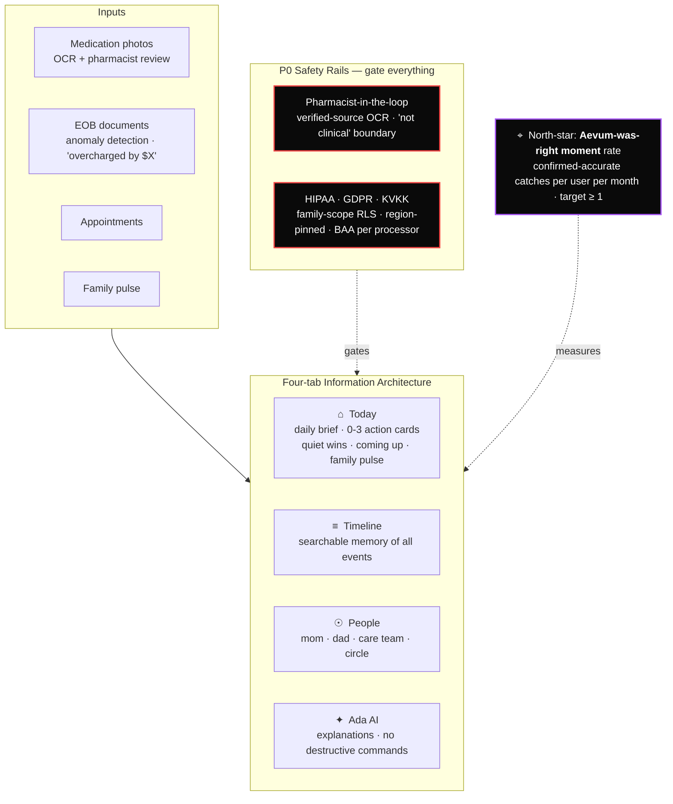

<div align="center">

<pre>
███████╗███╗   ███╗██████╗ ███████╗    ██████╗  ██████╗  ██████╗  █████╗ ███╗   ██╗
██╔════╝████╗ ████║██╔══██╗██╔════╝    ██╔══██╗██╔═══██╗██╔════╝ ██╔══██╗████╗  ██║
█████╗  ██╔████╔██║██████╔╝█████╗      ██║  ██║██║   ██║██║  ███╗███████║██╔██╗ ██║
██╔══╝  ██║╚██╔╝██║██╔══██╗██╔══╝      ██║  ██║██║   ██║██║   ██║██╔══██║██║╚██╗██║
███████╗██║ ╚═╝ ██║██║  ██║███████╗    ██████╔╝╚██████╔╝╚██████╔╝██║  ██║██║ ╚████║
╚══════╝╚═╝     ╚═╝╚═╝  ╚═╝╚══════╝    ╚═════╝  ╚═════╝  ╚═════╝ ╚═╝  ╚═╝╚═╝  ╚═══╝
</pre>

### Cloud Architect · SaaS Engineer · Mobile · Applied AI

**19 · Adana · GMT+3 · Two years self-taught · Zero shortcuts**

<sub>I build AI-native infrastructure designed for scale, automation, and operational leverage.<br/>
Production-grade systems · shipped with intention · powered by craft.</sub>

<br/>

[]([https://my-portfolio-amber-kappa-l6sl5h9955.vercel.app/](https://www.emredogan.work/))
[](https://www.linkedin.com/in/emre-do%C4%9Fan-657a99388/)
[](https://x.com/emredogancloud)
[](https://medium.com/@emre30283)

<sub><b>Available for Cloud, SaaS &amp; Mobile work</b> &nbsp;·&nbsp; <code>emre30283@gmail.com</code></sub>

</div>

---

## ◇ &nbsp;The Studio

I ship **AWS-native cloud architecture, AI-native SaaS, and cross-platform mobile** as a single engineering surface — built between 01:30 bakery shifts and high-school exams, on a Linux box in Adana. Each project below is a working reference for the patterns I use professionally: cross-account STS, multi-tenant SaaS, Terraform-managed infrastructure, container-image Lambdas, CUR-first cost engines, on-device pose analysis, and applied LLM systems with safety boundaries that hold under load.

Nothing here is a tutorial fork. Every architecture is the one I'd hand to a senior reviewer.

> **Long-arc systems. Hand-built infra. No templates, no shortcuts.**

---

## ◆ &nbsp;Engineering Ecosystem

How the studio fits together — products on top, shared primitives underneath.

```mermaid
flowchart TB
    classDef studio fill:#0a0a0a,stroke:#a855f7,stroke-width:2px,color:#fff
    classDef shipped fill:#0a0a0a,stroke:#22c55e,stroke-width:2px,color:#fff
    classDef testing fill:#0a0a0a,stroke:#eab308,stroke-width:2px,color:#fff
    classDef planning fill:#0a0a0a,stroke:#64748b,stroke-width:2px,color:#cbd5e1,stroke-dasharray:5 3
    classDef plat fill:#111111,stroke:#475569,stroke-width:1px,color:#e2e8f0
    classDef oss fill:#0a0a0a,stroke:#00d2ff,stroke-width:1.5px,color:#fff

    ED["⬣ emredogan.com<br/>cinematic portfolio · Lumina AI rep"]:::studio

    subgraph SHIPPED ["▲  SHIPPED IN PRODUCTION"]
        direction LR
        CWH["☁  Cloud Waste Hunter<br/><sub>multi-tenant FinOps SaaS</sub>"]:::shipped
        VCA["✦  VibingCoderAI<br/><sub>execution-kit generator</sub>"]:::shipped
    end

    subgraph FLIGHT ["◐  IN FLIGHT"]
        direction LR
        FAI["♔  FormAI · SixPack AI<br/><sub>Flutter · BlazePose · IAP</sub>"]:::testing
        PD["⊕  PawDoc<br/><sub>AI pet-health triage</sub>"]:::planning
        AV["✺  Aevum<br/><sub>caregiving operating system</sub>"]:::planning
    end

    subgraph OSS ["○  OPEN SOURCE PACKAGES"]
        direction LR
        LC["@emredogan/lumina-chat<br/><sub>cinematic AI chat widget</sub>"]:::oss
        CLI["@emredogan/cli<br/><sub>POSIX terminal companion</sub>"]:::oss
    end

    subgraph PLATFORM ["━━━ PRIMITIVES I REACH FOR ━━━"]
        direction LR
        AWS["AWS<br/>Lambda · API GW · Cognito<br/>DynamoDB · Bedrock · Athena"]:::plat
        IAC["Terraform<br/>S3 remote state · workspaces<br/>phase-separated apply"]:::plat
        VRC["Vercel<br/>edge · KV · ISR · analytics"]:::plat
        SUP["Supabase<br/>Postgres RLS · Edge Functions<br/>Auth · Storage"]:::plat
        ANT["Anthropic Claude<br/>pinned snapshots<br/>ephemeral prompt cache"]:::plat
        OBS["Sentry · PostHog · CloudWatch<br/>structured logging · req-id propagation"]:::plat
    end

    ED -.->|deploys on| VRC
    ED -.->|chats with| ANT
    ED -.->|emits| LC
    ED -.->|emits| CLI

    CWH ==> AWS
    CWH ==> IAC
    CWH ==> ANT
    CWH ==> OBS

    VCA ==> AWS
    VCA ==> VRC
    VCA ==> IAC
    VCA ==> ANT

    FAI ==> SUP
    FAI ==> OBS
    FAI -.-> IAC

    PD --> SUP
    PD --> ANT
    PD --> OBS

    AV -.planned.-> AWS
    AV -.planned.-> ANT
    AV -.planned.-> SUP
```



---

## ▲ &nbsp;Featured Work

Six projects, in priority order. Each one is the architecture, not a screenshot.

<table>
<tr>
<td width="33%" align="center"><b>▲ LIVE</b><br/><sub>emredogan.com</sub></td>
<td width="33%" align="center"><b>▲ LIVE</b><br/><sub>cloudwastehunter.io</sub></td>
<td width="33%" align="center"><b>▲ LIVE</b><br/><sub>vibingcoderai.com</sub></td>
</tr>
<tr>
<td align="center">my-portfolio</td>
<td align="center">Cloud Waste Hunter</td>
<td align="center">VibingCoderAI</td>
</tr>
<tr>
<td width="33%" align="center"><b>◐ INTERNAL TESTING</b><br/><sub>Play Store track live</sub></td>
<td width="33%" align="center"><b>○ FOUNDATION</b><br/><sub>Phase 0 — infra scaffold</sub></td>
<td width="33%" align="center"><b>○ STRATEGY</b><br/><sub>pre-seed memo</sub></td>
</tr>
<tr>
<td align="center">FormAI · SixPack AI</td>
<td align="center">PawDoc</td>
<td align="center">Aevum</td>
</tr>
</table>

---

### `01` &nbsp;**my-portfolio** — the cinematic landing page

> **Cinematic, AI-native portfolio. RSC-first, hydration-safe, 60fps motion, graceful degradation when third-party services aren't configured.**

The site is not a marketing page — it's a small but complete product. An opening cinematic with `prefers-reduced-motion` fallback, **Lumina** (an embedded AI representative streaming Claude Haiku 4.5 via the Vercel AI SDK v6), a type-safe contact pipeline using React 19 Server Actions + Resend with honeypot anti-spam, a public `/telemetry` dashboard rendering Lumina p95 latency from Vercel KV, and a `/changelog` that turns every push to my org into a WHY-annotated card. Two extracted open-source packages ship alongside it.



| | |
|---|---|
| **Stack** | Next.js 16 · React 19 · TypeScript strict · Tailwind v4 · motion/react · Vercel AI SDK v6 · `@ai-sdk/anthropic` · Resend · Vercel KV · `@octokit/rest` · Sentry · React Three Fiber |
| **Highlights** | Runtime-aware Sentry instrumentation (server vs. edge) · `claude-haiku-4-5-20251001` pinned (no floating aliases) · sigstore provenance on every npm publish · `prefers-reduced-motion` everywhere · zero client JS on static segments |
| **Open source** | [`@emredogan/lumina-chat`](https://www.npmjs.com/package/@emredogan/lumina-chat) — drop-in cinematic AI chat widget · [`@emredogan/cli`](https://www.npmjs.com/package/@emredogan/cli) — POSIX terminal companion (zero deps) |
| **Live** | [emredogan.com](https://www.emredogan.work/) |

---

### `02` &nbsp;**Cloud Waste Hunter** — multi-tenant FinOps SaaS

> **Scans connected AWS accounts for zombie resources. Quantifies the exact monthly dollar burn. Explains the fix with Bedrock — without ever generating destructive commands.**

A production-grade multi-tenant SaaS over **30+ resource collectors** (EC2, EBS, RDS, KMS, NAT, EIP, ELB/ALB/NLB, Lambda, Glue, EMR, SageMaker, DocumentDB, FSx, AppRunner, Synthetics, CloudFront, S3, DynamoDB, …). Pricing pulls from the customer's own **CUR 2.0 data lake** via Athena, with a DynamoDB-cached AWS Pricing API as fallback and static rates as last resort. An **8-check security analytics layer** issues a weighted A–F grade. The Bedrock advisor explains and ranks; remediation commands come from a **deterministic playbook engine** — never the model.



| | |
|---|---|
| **Stack** | Python 3.11 · FastAPI 0.109 · Mangum · Pydantic v2 · boto3 1.42 · React 19 · Vite 7 · Tailwind v4 · Cognito · DynamoDB · Athena · Glue · Bedrock · CloudFront · WAF · Terraform 1.12 |
| **Highlights** | Dual-mode Lambda handler (HTTP + async work, singular container) · CUR-first cost engine with graceful degradation · cross-account STS with auto-generated ExternalId + one-click CFN template · Function URL bypasses API Gateway's 30s ceiling for streaming chat · two-phase Terraform (stateful + ephemeral) with S3 remote state and workspaces |
| **Live** | [cloudwastehunter.io](https://www.cloudwastehunter.io/) |

---

### `03` &nbsp;**VibingCoderAI** — prompt engineering as a service

> **Type a casual idea. Get a senior-grade Execution Kit: tech-stack decision, full file tree, pinned setup commands, phased build plan, an `instructions.md` payload your local agent can execute end-to-end without hallucinations.**

A **deliberately decoupled cross-cloud** stack: **Vercel for the edge, AWS for the brain.** Three generation modes (`code` · 4 credits, `image` · 1, `video` · 1), each with its own strict system prompt wrapped as an ephemeral cache block. A **two-bucket credit economy** (daily reset + never-expiring purchased), reservation/refund via **DynamoDB optimistic concurrency control** so an Anthropic failure never leaks a credit. LemonSqueezy subscriptions, signature-verified webhooks, payment attribution from verified email — never client-supplied IDs.



| | |
|---|---|
| **Stack** | Next.js 16 · React 19 · Tailwind v4 · AWS Amplify v6 · Node 20 Lambda (Docker) · `@anthropic-ai/sdk` · AWS SDK v3 · DynamoDB · Cognito · LemonSqueezy · Terraform 1.6+ |
| **Highlights** | Cross-cloud decoupling by design (no shared code) · ephemeral prompt caching for ~16% input savings · OCC credit reservation with `ConditionalCheckFailedException` retry loop · payment sub-resolution via `cognito-idp:ListUsers` (closes account-takeover vector) · zero-dependency local Lambda adapter for HTTP API v2 event shapes · least-privilege IAM (no `dynamodb:Scan`) |
| **Live** | [vibingcoderai.com](https://www.vibingcoderai.com/) |

---

### `04` &nbsp;**FormAI · SixPack AI** — camera-driven AI fitness coach

> **One Flutter codebase. On-device, real-time pose analysis via BlazePose. 138-exercise catalogue, 8 hand-written rule-based analyzers, server-of-truth subscription entitlements.**

Cross-platform mobile (iOS + Android) pairing a 30-day personalised programme with **on-device pose analysis** for live rep counting and form correction. Eight `PoseAnalyzer` subclasses convert BlazePose landmarks into rep counts and form scores; movements that lack a meaningful pose check route to a `SilentHoldAnalyzer` so the app never yells false corrections. RevenueCat drives UX, but a **Deno Edge Function mirrors every RC event** into a Postgres `pro_entitlements` table with idempotency on `last_event_id` — RLS-protected Pro endpoints check the server-side row.



| | |
|---|---|
| **Stack** | Flutter 3.22+ · Dart 3.4+ · Riverpod 3.3 · go_router 17.2 · supabase_flutter 2.5 · google_mlkit_pose_detection · RevenueCat SDK · home_widget · live_activities · Sentry · PostHog · Terraform + AWS (legal hosting) |
| **Highlights** | Paranoid 4-layer bootstrap (runZonedGuarded + FlutterError.onError + PlatformDispatcher.onError + branded ErrorWidget) — `runApp` is reached exactly once, even when every dependency fails · rule-based pose engine (no black-box ML) · entitlements server-of-truth with idempotent webhook mirror · privacy as a build-time concern (Sentry `beforeSend` consent gate, PII null-out) · warm incremental build ≈ 7s |
| **Status** | Internal Testing track live · production rollout gated on `docs/MASTER_LAUNCH_ROADMAP.md` |

---

### `05` &nbsp;**PawDoc** — AI-native pet health triage

> **Photo, video, or text → instant guidance: EMERGENCY · MONITOR · LIKELY NORMAL. The mobile app never talks to AI providers directly.**

Multi-tier monorepo: Flutter mobile (iOS + Android), Supabase backend (Postgres + Auth + Storage + Edge Functions), Python FastAPI AI orchestrator on Fly.io, Cloudflare R2 for media uploads. Every analysis flows through **Edge Functions enforcing auth, rate limits, free-tier quotas, and ownership** before forwarding to the AI service. An **emergency keyword guard runs before any model call** — genuinely urgent cases bypass the paid analysis path entirely. Structured JSON enforced from every AI response; free-text rejected. Disclaimer injected at the API layer so UI changes cannot remove it.



| | |
|---|---|
| **Stack** | Flutter 3.41 · Dart 3.11 · Riverpod 2.6 · go_router 14 · FastAPI 0.115 · Python 3.12 · uv · Pydantic v2 · structlog · sentry-sdk · Supabase Postgres + Edge Functions (Deno) · Cloudflare R2 · Upstash Redis · Fly.io · Doppler · Docker multi-stage |
| **Highlights** | Emergency override pre-flight (hardcoded keyword guard before metered providers) · server-side validation religion (rate limit, ownership, paywall — never trust the client) · semantic cache via OpenAI embeddings + Redis · multi-stage `uv`-based Docker (non-root, tini, healthcheck) · disclaimer injected at API layer · RLS on every table |
| **Status** | Phase 0 (foundation & infrastructure) in progress |

---

### `06` &nbsp;**Aevum** — the calm operating system for caregiving

> *"We are not building 'AI for caregivers.' We are building the calm operating system that adult children put between themselves and the chaos of aging parents. The product is relief."*

A single trusted surface where medication tracking, insurance triage (EOB anomaly detection), family coordination, and AI-powered daily briefings converge. Target user: the employed adult child (38–62) coordinating care for one or more aging parents. The product's emotional job is to absorb cognitive fragmentation — the user opens Aevum and feels relief because something else is holding the bag.



| | |
|---|---|
| **Stage** | Pre-build strategic workspace — startup memo, execution roadmap, growth/monetization/risk/tech reports complete. No app code yet; strategy is the source of truth. |
| **Monetization** | Free · Family ($179/yr) · Family+ ($279/yr) · Memorial ($49/yr) · Concierge ($599/yr) · B2B2C from Year 2 (Medicare Advantage, employer caregiver benefits) |
| **P0 Risks** | (1) AI medication extraction error → patient harm (mitigation: pharmacist-in-the-loop, verified-source OCR). (2) HIPAA / GDPR / KVKK exposure (mitigation: encryption at rest + transit, BAA per processor, family-scope RLS, region-pinned data planes). |

---

## ▣ &nbsp;Tech Stack

Drawn from the codebases above — every item is something I've shipped, not something I've read about.

```
☁  CLOUD & INFRASTRUCTURE
   AWS · Lambda · API Gateway v2 · Cognito User Pools · DynamoDB
   S3 · CloudFront · WAF · Bedrock · Athena · Glue · Secrets Manager
   EventBridge · SES · CloudWatch · X-Ray · STS AssumeRole · Budgets

⚙  INFRASTRUCTURE AS CODE
   Terraform 1.6+ · phase-separated apply · S3 remote state · workspaces
   Docker · multi-stage builds · container-image Lambdas
   GitHub Actions · OIDC · sigstore provenance

▲  EDGE & FRONTEND
   Next.js 16 (App Router · RSC-first) · React 19 · TypeScript strict
   Tailwind v4 · motion/react · Vercel KV · ISR · Vite 7
   AWS Amplify v6 · React Three Fiber

☎  MOBILE
   Flutter 3.22+ · Dart 3.4+ · Riverpod 3.x · go_router
   Google ML Kit (BlazePose) · RevenueCat · home_widget · live_activities
   Native bridges (Kotlin AppWidgetProvider · SwiftUI WidgetKit)

✦  AI & LLMs
   Anthropic Claude (Haiku 4.5 · Sonnet 4.5) · pinned model snapshots
   Amazon Bedrock · Vercel AI SDK v6 · @ai-sdk/anthropic
   Google AI (vision) · OpenAI text-embedding-3-small (cache only)
   Ephemeral prompt caching · structured JSON enforcement · safety guards

⛁  DATA
   DynamoDB (PAY_PER_REQUEST · OCC · GSI design)
   Supabase Postgres · Row-Level Security on every table
   Athena over CUR 2.0 · Upstash Redis (semantic cache)
   Cloudflare R2 · S3

⌬  BACKEND
   Python 3.11+ · FastAPI · Mangum · Pydantic v2 · uv · structlog
   Node.js 20 · @anthropic-ai/sdk · AWS SDK v3
   Deno · Supabase Edge Functions

♨  OBSERVABILITY & SECURITY
   Sentry (server + edge + mobile) · runtime-aware instrumentation
   PostHog (consent-gated) · CloudWatch · structured JSON logs
   Request-ID propagation via ContextVar
   HMAC webhook verification · CSP · HSTS · X-Frame-Options
   Doppler · AWS Secrets Manager · least-privilege IAM
```

---

## ◈ &nbsp;Engineering Principles

Rules I've earned, not rules I've read. Every one of these is enforced somewhere in the codebases above.

1. **Pin the model. Never float aliases.**
   Production runs `claude-haiku-4-5-20251001`, not `claude-haiku-4-5-latest`. Predictable behaviour, predictable cost, predictable rollbacks.

2. **Server-of-truth for entitlements, always.**
   RevenueCat/LemonSqueezy drives UX, but the row in Postgres/DynamoDB is the canonical answer. Webhooks are idempotent on `last_event_id` and HMAC-verified with `timingSafeEqual`.

3. **RLS on every table. JWT on every endpoint.**
   One IAM policy and one missing partition-key check is the whole tenant-isolation surface — intentionally. Cross-user data leaks are an application-class bug I won't tolerate.

4. **Safety guards run before paid model calls.**
   Emergency keyword detection (PawDoc), deterministic playbook engines instead of freeform LLM remediation (Cloud Waste Hunter), explanation-only Bedrock advisors. The model is a tool, not a co-pilot for destructive operations.

5. **Cost ceilings are designed in, not bolted on.**
   API Gateway throttling. AWS Budgets with forecasted-spend alarms. Anthropic ephemeral prompt caching. PAY_PER_REQUEST DynamoDB. Function URLs to bypass API Gateway 30s timeouts cleanly instead of bloating Lambda timeouts.

6. **Paranoid bootstrap. Graceful degradation.**
   `runApp` is reached exactly once, even when every dependency below it is broken. Missing API keys return `503` with a clear message — they never crash the page. Empty `.env` boots cleanly.

7. **Decoupled clouds by design.**
   Vercel for the edge, AWS for the brain. Frontend and backend never share code; they communicate over one public HTTPS contract. Egress bills are clear. Security boundaries are real.

8. **No console-clicked state. Terraform owns everything.**
   Two-phase apply (stateful + ephemeral). Remote S3 backend. Workspaces per environment. CI runs `terraform apply`, never humans.

---

## ○ &nbsp;Open Source

<table>
<tr>
<td valign="top" width="50%">

**[`@emredogan/lumina-chat`](https://www.npmjs.com/package/@emredogan/lumina-chat)**

Drop-in cinematic AI chat widget. The same Lumina that ships on emredogan.com, extracted as a reusable React package. Neural-core avatar, smooth motion, tool-use rendering, voice-ready. Bring your own `/api/chat` endpoint.

Published with [sigstore provenance](https://docs.npmjs.com/generating-provenance-statements) — every tarball is OIDC-attested to the exact workflow run that built it.

```bash
npm install @emredogan/lumina-chat
```

</td>
<td valign="top" width="50%">

**[`@emredogan/cli`](https://www.npmjs.com/package/@emredogan/cli)**

Terminal companion for emredogan.com. Four commands, zero dependencies, POSIX-only (macOS + Linux). Ask Lumina from the shell, list projects, open a `/lab` experiment in the browser.

```bash
npx emredogan ask "How is /telemetry cached?"
```

</td>
</tr>
</table>

---

## ⟶ &nbsp;Now

```
▲  Cloud Waste Hunter   →  cost anomaly detection over CUR · multi-region Glue partitioning
▲  VibingCoderAI         →  SSE streaming for long kits · Lambda Powertools idempotency
◐  FormAI                →  Play Store production track · onboarding redesign
○  PawDoc                →  Phase 1 MVP — camera → AI → result + auth + paywall
○  Aevum                 →  pre-seed memo refinement · validating B2B2C distribution
✦  Always                →  AWS Solutions Architect Associate (in progress)
```

---

<div align="center">

### Reach out

If you're building **cloud-native SaaS, applied AI, or cross-platform mobile** — or hiring for it — I'd love to talk.

[](mailto:emre30283@gmail.com)
[](https://www.emredogan.work/)
[](https://www.linkedin.com/in/emre-do%C4%9Fan-657a99388/)

<br/>

<sub>Built with restraint, opinionated defaults, and a hard cost ceiling.<br/>
Adana · GMT+3 · Two years self-taught · Zero shortcuts.</sub>

</div>
